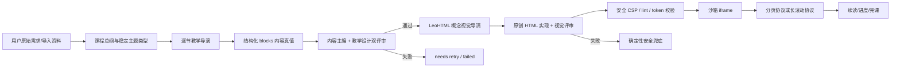

# 课件生成 LeoHTML 改造与全角色对抗审计

日期：2026-08-11

范围：一句话造课、资料导入、大纲检查点、逐节内容生成、双评审、原创 HTML、学习页承载、进度/完课、积分与发布终态。

结论：不应让 LeoHTML Skill 替代整条课程生成链；应把它作为“表现层视觉导演方法”，继续保留结构化 blocks、教学评审、答案真值、权限/积分、沙箱与确定性兜底。本轮已按这个边界完成第一阶段改造。

## 1. 改造后的职责边界

LeoHTML 的价值在 F/G：先明确受众动作与体验承诺，生成 A/B/C 三个真正不同的概念方向，选择一个，再定义表面原型、空间组织、信息节奏、素材角色、动效行为、场面预算、课程家族规则与每节变化规则。它不接管 D/E/H/K，因为这些层需要稳定、可测试、可追溯的产品协议。

## 2. 本轮已经修复的发布阻断问题

| 优先级 | 对抗场景 | 原故障 | 修复结果 |
|---|---|---|---|
| P0 | 专业模式生成大纲后不改直接确认 | `summary/objective` 在 API→组件→PATCH 往返中被清空 | 生成/导入回包、草稿恢复、检查点初值与 PATCH 全链保留 `summary`；显式清空才写空 |
| P0 | 所有稿件双评审未通过但 blocks 非空 | 课程仍被标成 `ready`，UI 宣称可学 | 统一 `passed / fallback / best_effort_failed / best_effort_unverified` 终态判定；后台、轮询自愈、续造均不得把失败稿置 ready |
| P0 | 题目选项与解析正确，但 `answerIndex` 错误 | 教学评审看不到答案键，学习者会被错判 | 新增 assessment manifest；评审逐题核对答案键/正确答案文本/解析；缺失或越界答案键直接丢弃坏题，不再静默归 0 |
| P0 | LLM 原创 HTML 成功 | bespoke 不发 `ct-ready`，宿主无续读、页进度和完课闭环 | 新增 `ct-scroll-ready` v2；宿主量化滚动进度，底部 sentinel 才触发一次完课；旧 v1 适配器自动迁移 |
| P0 | 历史缓存复用旧 LLM HTML | 旧 `__ctBespokeAdapter` 令新协议注入被跳过 | 渲染版本升到 v6.1.0；注入器移除旧壳后装 v2，保持幂等 |
| P1 | 原始社会议题被生成标题改写为技术教程 | 大纲、导演、作者、评审使用不同分类输入 | 四阶段统一以 `contentBrief.request + course title + lesson title` 为上下文，原始需求优先；导入分类同时读取标题和正文 |
| P1 | 双评审通过后立即 `break` | 确定性块滥用检查永远来不及执行 | 高精度结构纪律在 break 前执行、参与候选评分与发布门，并进入失败反馈 |
| P1 | 用户看到固定视觉卡样与“所见即所得” | 后端实际只把 template 当语气提示 | 改名为“教学方式（可选）”，移除固定视觉样张与视觉承诺；默认空值进入自由导演 |
| P1 | 完成页显示 N 个测验/N 张卡片 | 实际只是拿成功章节数冒充 | 删除伪计数，改为“按内容组织互动”；导入权益文案不再承诺每节固定测验/卡片 |
| P1 | 全屏 API 不存在、按钮/链接聚焦时快捷键误触 | CSS 兜底不可达，键盘可能劫持交互 | 修正全屏 fallback；输入、按钮、链接、contenteditable 均不劫持翻页快捷键 |
| P1 | 供应链漏洞 | 4 high + 2 moderate | 非破坏性升级 5 个间接依赖；`npm audit` 归零 |

## 3. LeoHTML 方法落地内容

- 每节设计先产出 `audience / learnerAction / promise / tension / visualMetaphor`。
- 强制形成 A/B/C 三个在空间、节奏、素材、动效与风险上都完整且不同的候选，不能只换颜色或名字。
- 表面原型只描述学习任务：`decide-learn / operate / compare / explore / inspect / immerse`，不是固定页面模板。
- 每节只给 1-3 个重点场面分配视觉预算，互动必须解释其教学作用。
- 首节建立课程视觉家族规则，后续节继承家族感但必须遵守变化规则；只回看最近三节以控制上下文成本。
- 设计 token 继续走 OKLCH 合法值、字体白名单与 WCAG 对比度硬门；生成 HTML 必须原样声明并实际使用 token。
- reduced-motion 必须给出完整静帧终态；320-1440px 响应式、44px 触控、键盘/focus、aria-live 均进入实现提示。
- 用户正文与 blocks 被明确标记为不可信数据，不能通过内容注入改写系统角色、协议或网络权限。
- 设计 Agent 重试由 10 次收紧为 3 次；HTML 实现仍有最多 4 次质量修正，最终保留确定性安全网。

## 4. 全角色审计结果

### 产品负责人

通过：模板承诺与真实能力已对齐；质量失败不再庆祝成功；长滚动课件有完整学习闭环。

待办：产品状态仍只有 `ready/failed`，建议后续迁移为 `rendered/publishable/needs_review` 三维状态，避免“技术可打开”和“教学可发布”共用一个枚举。

### 教学设计师

通过：逐节目标不再丢失；答案真值进入评审；块滥用机检真正参与门控。

待办（P1）：导演仍要求每节都含理解检验与迁移任务，短定义、史实索引或参考型课可能被机械加题。应在课程级 assessment map 中为每节标 `none/check/practice/transfer`，综合迁移只放关键节点。

### 内容主编与事实核查

通过：主题类型跨阶段稳定；史实、社会议题、时事、人物、行业、学科、快变技术使用不同结构与举证提醒。

待办（P0/P1）：非导入课程没有外部事实真值。涉及“最新、当前价格、政策、快变 API”的课程仍可能由同类模型自评过门。应增加来源地图、资料截至日期和 `insufficient_information`，对高时效断言没有官方来源时不得发布。

### 视觉总监

通过：视觉设计不再从固定皮肤选择；概念方向、场面预算、家族与变化规则已结构化落库；失败仍可回落。24 张确定性回归图均成功，抽查纸张、暗色科技、故事长卷和终端方向无空白/裁切。

待办（P1）：当前生产视觉评审仍主要读 HTML 源码，没有把桌面/手机真实截图作为 LLM 视觉评审硬输入。`render-check` 已能落两档截图，但上线前还应增加截图级人工/视觉模型抽检。

### 前端与无障碍

通过：原创长滚动与确定性分页协议分离；续读、进度和完课闭环；iframe eager 加载；全屏兜底和快捷键边界修复。浏览器审计覆盖桌面/平板/手机共 15 个公开页面，axe、横向溢出、console、4xx/5xx 均为 0。

待办（P1）：旧 BlockRenderer 内个别 quiz/flashcard 的焦点管理和状态播报仍应做组件级键盘走查，不能只依赖页面 axe 静态扫描。

### 安全工程师

通过：生成写接口具备登录、同源、限流、作者归属和原子 claim；课件路由按课程可见性/权益鉴权；iframe 只有 `allow-scripts`，没有 `allow-same-origin`、top-navigation、popup 或 form；文档 CSP `default-src 'none'`、`connect-src 'none'`，素材只允许站内鉴权图片内联；依赖审计 0 漏洞。

待办（P2）：`postMessage` 因 sandbox 不透明源不能校验 origin，只能校验 `event.source` 和严格消息结构；这是当前架构可接受的边界，应持续禁止给 iframe 增加 `allow-same-origin`。

### 成本与可靠性

通过：所有作者、内容评审、教学评审、设计、HTML 和视觉评审调用都按真实 token 记账；逐节读取实时余额；内容和 HTML 都有有限重试；claim、防重与僵尸任务恢复存在。设计重试从 10 降为 3。

待办（P1）：逐节余额门当前只按“一次内容 + 一次 HTML”的典型成本预留，而理论最坏可达 19 次内容场景调用 + 11 次 HTML 场景调用。虽然实际支出全记账且透支被限制在当前一节，极端坏模型仍可产生较大负余额。应按产品可接受成功率设计“调用前逐次额度预留”或课程预算上限，而不是简单用最坏值把正常月度额度全部挡住。

### QA / 发布工程

通过：新增大纲 round-trip、答案 manifest、非法答案键、质量失败终态、主题一致性、适配器 v1→v2 迁移测试；CI 新增长滚动/分页双协议真实 App E2E。

待办（P1）：整课尚无 course-level coverage judge；逐节均通过仍可能全课重复、遗漏目标或 capstone 未兑现。建议生成后做一次 objective→evidence→assessment 对账，只重造问题节。

## 5. 验证证据

- `npm test`：46 files / 419 tests passed。
- 本轮定向回归：8 files / 76 tests passed。
- `npm run lint`：通过，0 warning。
- `npx tsc --noEmit`：通过。
- `npm run build`：Next.js 15.5.21 生产构建通过，63 个静态页生成完成。
- `npm audit --audit-level=moderate`：0 vulnerabilities。
- `npm run check:embed`：5/5，通过分页握手、iframe 可见文本、翻页进度、软导航、bespoke 底部幂等完课。
- `tests/browser-audit.mjs`：桌面/平板/手机 15 个公开页面 + 登录态造课/私有视频 + 错误态通过；axe/overflow/console/HTTP failure 均为 0。
- `npm run snap:courseware`：12 种确定性艺术方向、24 张快照全部完成。
- 本机 Node 为 v26，超出仓库声明的 `>=20 <23`；构建与测试虽通过，CI 使用 Node 20 才是正式发布口径。

## 6. 发布建议

本轮可以合入：它修复了 4 个确定性 P0（目标丢失、假 ready、答案键盲区、原创 HTML 无完课）并把 LeoHTML 放在正确的表现层边界。不能据此宣称“所有课程事实都可靠”或“整课教学质量已自动终审”；外部来源与整课 coverage judge 应作为下一阶段发布门，而不是继续往单节 prompt 里堆规则。
